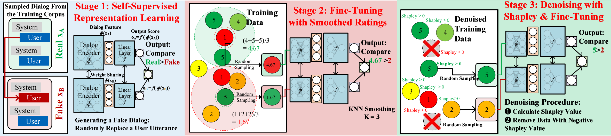
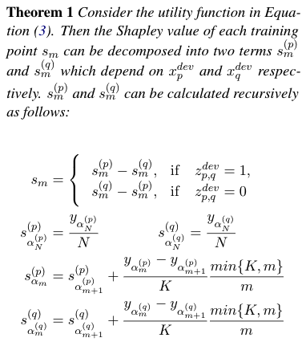

# Beyond User Self-Reported Likert Scale Ratings: A Comparison Model for Automatic Dialog Evaluation

[](https://github.com/Weixin-Liang/dialog_evaluation_CMADE/blob/master/LICENSE)

This repo provides the PyTorch source code of our paper: [Beyond User Self-Reported Likert Scale Ratings: A Comparison Model for Automatic Dialog Evaluation](https://www.aclweb.org/anthology/2020.acl-main.126/) (ACL 2020). 
[[PDF]](https://www.aclweb.org/anthology/2020.acl-main.126.pdf)[[Video]](https://slideslive.com/38928690/beyond-user-selfreported-likert-scale-ratings-a-comparison-model-for-automatic-dialog-evaluation)
[[Stanford AI Lab Blog]](https://ai.stanford.edu/blog/acl-2020/)
[[Slides]](https://drive.google.com/file/d/1hpuUCyz81bqtg1-De9C1ostgiJA519Vj/view?usp=sharing)
[[Code]](https://github.com/Weixin-Liang/dialog_evaluation_CMADE/)


```
@inproceedings{liang2021beyond,
  author    = {Weixin Liang and
               James Zou and
               Zhou Yu},
  title     = {Beyond User Self-Reported Likert Scale Ratings: {A} Comparison Model
               for Automatic Dialog Evaluation},
  booktitle = {{ACL}},
  pages     = {1363--1374},
  publisher = {Association for Computational Linguistics},
  year      = {2020}
}
```


## Abstract
*Open Domain dialog system evaluation is one of the most important challenges in dialog research. 
Existing automatic evaluation metrics, such as BLEU are mostly reference-based. They calculate the difference between the generated response and 
a limited number of available references. 
Likert-score based self-reported user rating is widely adopted by social conversational systems, such as Amazon Alexa Prize chatbots. However, self-reported user rating suffers from bias and variance among different users. To alleviate this problem, we formulate dialog evaluation as a comparison task. We also propose an automatic evaluation model CMADE (Comparison Model for Automatic Dialog Evaluation) that automatically cleans self-reported user ratings as it trains on them.  Specifically, we first use a self-supervised method to learn better dialog feature representation, and then use KNN and Shapley to remove confusing samples. 
Our experiments show that CMADE 
 achieves 89.2\% accuracy in the dialog comparison task. 
Our implementation is available at https://github.com/Weixin-Liang/dialog_evaluation_CMADE*


## Overview
<p align='center'>
  
</p>
Figure: Schematic of the CMADE workflow. 
CMADE contains a three-stage training pipeline to denoise self-reported ratings to train an automatic dialog comparison model: 
learning representation viaself-supervised dialog flow anomaly detection, 
fine-tuning with smoothed self-reported user ratings,
denoising with data Shapley & further fine-tuning. 
The gray and blue rectangles in stage 1 represents system and user utterances. The red rectangle in stage 1 represents the randomly replaced system utterance 
for dialog flow perturbation. 
In stage 2 & 3, each ball represents a dialog in the training data. The number on each ball represents the dialog rating. 


## BERT-based Dialog Comparison Model
### Dependencies
Run the following commands to create a conda environment (assuming CUDA10.1):
```bash
conda create -n herald python=3.6
conda activate herald
conda install pytorch torchvision torchaudio cudatoolkit=10.2 -c pytorch
conda install matplotlib scipy
conda install -c conda-forge scikit-learn 
conda install -c conda-forge transformers
conda install pandas
```
Please check [requirements.txt](requirements.txt) or [requirements.yml](requirements.yml) for additional details about the dependencies (Note that you don't need to install all of them). 


#### Training
```sh
python bert_dialog_evaluator.py --model_name bert_spc
```
Our 3-stage pipeline is detailed in the [bert_dialog_evaluator.py/pipeline_3_stages](bert_dialog_evaluator.pyL1043-L1083)  function. 
The code is built upon the github repo [ABSA-PyTorch](https://github.com/songyouwei/ABSA-PyTorch). 
Many thanks to the authors and developers!

## Stage 1: Learning Representation viaself-supervised dialog anomaly detection
```py
checkpoint_path = self.run_stage_1()
logger.info('stage_1 checkpoint_path: {}'.format(checkpoint_path))        
```

## Stage 2: Fine-tuning with smoothed self-reported user ratings
```py
train_data_loader = DataLoader(dataset=self.trainset, batch_size=self.opt.batch_size, shuffle=True, drop_last=True)
checkpoint_path = self._train_stage_2(criterion, optimizer, train_data_loader)
```
where we call the [knn_smooth_scores](algorithm_utils.py#L64-L93)  function in [algorithm_utils.py](algorithm_utils.py) 
```py
neigh = KNeighborsRegressor(n_neighbors=n_neighbors)  
neigh.fit(X, y) 
y_smoothed = neigh.predict(X) # KNN-smoothing
```


## Stage 3: Denoising with data Shapley & further fine-tuning
```py
train_data_loader = DataLoader(dataset=self.trainset, batch_size=self.opt.batch_size, shuffle=True)
self.extract_kmeans_newset(train_data_loader, "shapley")
global_shapley_arr = do_knn_shapley() # Calculate Shapley Value

# Remove data points with negative Shapley value 
next_trainset_pool = ABSADataset()
for i in range(global_shapley_arr.shape[0]):
    if global_shapley_arr[i] > 0.: 
        # Only keep data points with positive Shapley value
        next_trainset_pool.data.append(self.trainset.data[i])     

logger.info('After shapley: len(next_trainset_pool.data) {}, global_shapley_arr {}'.format( len(next_trainset_pool.data), global_shapley_arr ))

# Further fine-tuning
train_data_loader = DataLoader(dataset=next_trainset_pool, batch_size=self.opt.batch_size, shuffle=True, drop_last=True)
best_model_path = self._train_stage_3(criterion, optimizer, train_data_loader)
logger.info('After shapley best_model_path: {}'.format(best_model_path))
self.model.load_state_dict(torch.load(best_model_path))
pair_acc, pair_f1 = self._pair_annotated_evaluate(isTestFlag=False)   
pair_acc, pair_f1 = self._pair_annotated_evaluate(isTestFlag=True)  
```
Here we first calculate the Shaley value, and then remove data points with negative Shapley value, and then futher fine-tune the model. 
We call the [do_knn_shapley](algorithm_utils.py#L95-L167) function in [algorithm_utils.py](algorithm_utils.py) to calculate the Shaley value, based on the following theorem. 

<p align='center'>
  
</p>

In particular, the [core implementation](algorithm_utils.py#L118-L140) of the theorem is: 
```py
def single_point_shapley(xt_query):
    distance1 = np.sum(np.square(X-xt_query), axis=1)
    alpha = np.argsort(distance1)
    shapley_arr = np.zeros(N)
    for i in range(N-1, -1, -1): 
        if i == N-1: 
            shapley_arr[alpha[i]] = y[alpha[i]]/N
        else:
            shapley_arr[alpha[i]] = shapley_arr[alpha[i+1]] + (y[alpha[i]] - y[alpha[i+1]])/K * min(K,i+1)/(i+1)
            # we use (i+1) here since i starts from zero in our python implementaion. 
    return shapley_arr

global_shapley_arr = np.zeros(N)
for xt1, xt2, cmplabel in zip(X_test_1, X_test_2, y_test_pair):
    s1 = single_point_shapley(xt1)
    s2 = single_point_shapley(xt2)
    if cmplabel==0:
        global_shapley_arr += s1 - s2
    else:
        global_shapley_arr += s2 - s1
global_shapley_arr /= y_test_pair.shape[0]
```


## Related Papers on Data Shapley
[HERALD: An Annotation Efficient Method to Train User Engagement Predictors in Dialogs](http://www.cs.columbia.edu/~zhouyu/) (ACL 2021). 
Weixin Liang, Kai-Hui Liang and Zhou Yu. 
[[PDF]](http://www.cs.columbia.edu/~zhouyu/)
[[Code]](https://github.com/Weixin-Liang/HERALD)

[Data Shapley: Equitable Data Valuation for Machine Learning. ](https://arxiv.org/abs/1904.02868) (ICML 2019). 
Amirata Ghorbani, James Zou. 
[[PDF]](http://proceedings.mlr.press/v97/ghorbani19c/ghorbani19c.pdf)
[[Video]](https://slideslive.com/38917630/supervised-learning)
[[Poster]](https://drive.google.com/file/d/19iX2faH2Y0SE5Yn_yCmOaKAUvp57oB6y/view)
[[Slides]](https://docs.google.com/presentation/d/10Crejw-CgyS0G_16KC8cHcnoVPdDsibfFmmiHbN22Ek/edit)
[[Code]](https://github.com/amiratag/DataShapley)

## Contact
Thank you for your interest in our work! Please contact me at wxliang@stanford.edu for any questions, comments, or suggestions! 